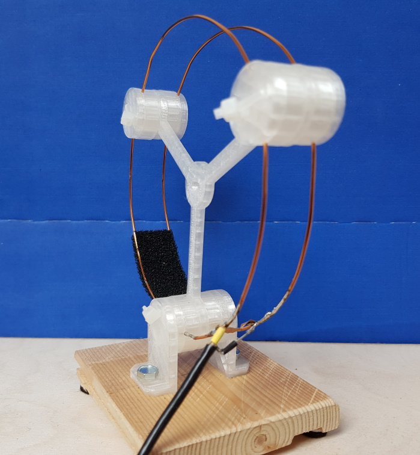

# **3D Printed Half Wave Ring Antenna Holder**

### **For a 433 MHz antenna with good receiving characteristics**

#### print list
- carry      1x
- guide_high 6x
- guide_low  6x    
- mount      2x

  [-> 3D print .stl files](print3D)

#### assembly
- prepare two wire loops, look at  
  https://diydrones.com/profiles/blogs/more-433-mhz-antenna-the-1-2wave-ring-radiator
  
  discrepancy:  
  the guides grooves are designed for 1 mm (enameled) copper wire  
  using thicker wire might make the construction wobbly

- assemble three sandwiches  
  mind the grooves of the guides  
  one sandwich may hold the mounts  
  strap each sandwich with zip ties
  
  order  
  tie + (mount) + guide_low + wire-loop 1 + guide_high + carry + guide-high + wire-loop 2 + guide_low + (mount) + tie

- the antenna was tuned by positioning CMOS foam between the wire loops  
  surprisingly this worked very well and accurate

---

#### contact  
[qrt@qland.de](mailto:qrt@qland.de)
